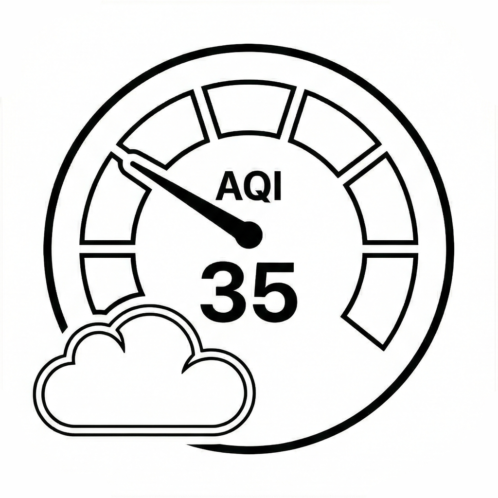

   

# AirCheck

A lightweight widget that provides real-time AQI monitoring from your Air purifier to help you stay informed about the air you breathe.

## Features

**App & Menu Bar**
- **Real-time AQI Tracking:** Live Air Quality Index data directly in your macOS/iOS Menu Bar.
- **Location-based Updates:** Automatically fetches air quality data based on your current location.
- **Automatic Refresh:** Data updates in the background at regular intervals.

## UI


## Data Sources

- **AQI Data** — [OpenWeatherMap Air Pollution API](https://openweathermap.org/api/air-pollution)
- **Geocoding** — Native Apple CoreLocation

## Tech Stack

- **SwiftUI**
- **CoreLocation**
- **Swift Concurrency**

## Requirements

- Xcode 16+
- macOS 15+

## How to Run

1. Clone the repository: `git clone https://github.com/adamstefanik/aircheckapp.git`
2. Open `aircheckapp.xcodeproj` in Xcode.
3. Add your OpenWeatherMap API Key in the `WeatherService.swift` (or relevant config file).
4. Build and run (Cmd + R).
5. The icon will appear in your Menu Bar.

## Structure
```
aircheckapp/
├── aircheckapp/
│   ├── Assets.xcassets/
│   ├── Views/
│   │   ├── AQIGaugeView.swift
│   │   └── DetailView.swift
│   ├── Services/
│   │   ├── APIService.swift
│   │   └── LocationManager.swift
│   ├── Models/ 
│   │   └── AQIResponse.swift
│   ├── aircheckappApp.swift
│   └── ContentView.swift 
├── aircheckapp.xcodeproj
├── assets/
├── LICENSE
└── README.md

```

## License
Made with functioning lungs for my pollen allergy by <a href="https://github.com/adamstefanik">Adam Samuel Štefánik</a>. MIT what else you expected — see [LICENSE](LICENSE).
