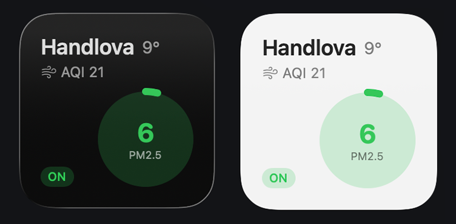

   

# AirCheck

iOS/macOS WidgetKit app for real-time monitoring of Xiaomi Air Purifier via local network. No cloud, no middleman — direct UDP communication using the miIO/MiOT protocol.

## Features

- **Live PM2.5** — indoor air quality directly from purifier via UDP
- **Outdoor AQI + temperature** — from AQICN API for your city
- **Small / Medium / Large widget** — all three sizes supported
- **5-minute refresh** — background timeline updates
- **Mac Catalyst** — works on macOS too

## Tech Stack

- **SwiftUI + WidgetKit**
- **Network.framework** — UDP via NWConnection
- **CommonCrypto** — AES-128-CBC (miIO encryption)
- **Swift Concurrency** — async/await throughout

## Requirements

- Xcode 16+
- iOS 17+ / macOS 14+
- Xiaomi Air Purifier on local network
- [AQICN API token](https://aqicn.org/data-platform/token/) (free, optional)

## Setup

1. Clone: `git clone https://github.com/adamstefanik/aircheckapp.git`
2. Copy secrets template:
   ```bash
   cp aircheckapp/Secrets.swift.template aircheckapp/Secrets.swift
   ```
3. Fill in `Secrets.swift` with your purifier IP and token
4. Open `aircheckapp.xcodeproj` in Xcode
5. Build & Run (`⌘R`)

### Getting your purifier token

```bash
pipx install python-miio
miiocli discover
```

## Project Structure

```
aircheckapp/
├── aircheckapp/
│   ├── MiIOCrypto.swift
│   ├── MiIOPacket.swift
│   ├── MiIOConnection.swift
│   ├── PurifierService.swift
│   ├── OutdoorService.swift
│   ├── ConfigStore.swift
│   ├── TokenStorage.swift
│   ├── SettingsView.swift
│   └── Secrets.swift
├── aircheckwidget/
│   ├── AirCheckWidget.swift
│   ├── WidgetSmallView.swift
│   ├── WidgetMediumView.swift
│   └── WidgetLargeView.swift
└── aircheckapp.xcodeproj
```

## License

Made with with lungs for my pollen allergy by [Adam Samuel Štefánik](https://github.com/adamstefanik). MIT — see [LICENSE](LICENSE).
